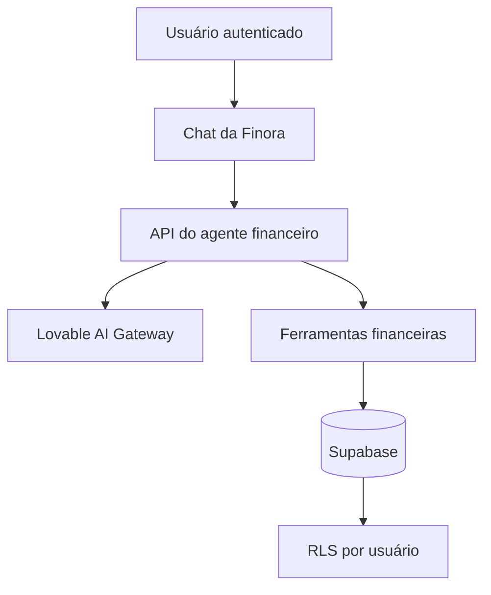

# Finora — assistente de finanças pessoais

Aplicação web de organização financeira que permite registrar e consultar movimentações por meio de uma conversa em linguagem natural.

A Finora foi desenvolvida como projeto do desafio **“Criando um App de Organização de Finanças Pessoais com Vibe Coding”**, da trilha **DIO | Codifique o seu futuro global agora**.

[](https://finora-chat-finance.lovable.app)

## Sobre o projeto

Muitas pessoas abandonam o controle financeiro porque aplicativos tradicionais exigem formulários, classificações manuais e relatórios difíceis de interpretar. A Finora reduz essa barreira: a pessoa escreve como fala, e o agente financeiro interpreta, registra, classifica e explica a movimentação.

Exemplos:

- “Gastei R$ 35 no mercado hoje.”
- “Recebi R$ 1.200 de um freela.”
- “Como está meu mês?”
- “Crie uma meta de R$ 1.000 para uma viagem.”
- “Me dê uma dica de economia.”

O agente responde sempre em português brasileiro, com linguagem acolhedora, educativa, objetiva e sem julgamentos.

## Funcionalidades do MVP

- Cadastro e autenticação por e-mail e senha.
- Login com Google.
- Recuperação e redefinição de senha.
- Registro de entradas e despesas em linguagem natural.
- Classificação automática em categorias financeiras.
- Correção da categoria da transação mais recente.
- Consulta de entradas, gastos, saldo e despesas por categoria.
- Criação e consulta de metas financeiras pela conversa.
- Dicas de economia baseadas nos registros reais do usuário.
- Histórico persistente das conversas.
- Isolamento dos dados por usuário com Row Level Security (RLS).
- Interface responsiva e mensagens de erro em português.

## Demonstração

**Aplicação:** https://finora-chat-finance.lovable.app

Para testar o fluxo principal:

1. Crie uma conta ou entre com o Google.
2. Registre uma entrada: “Recebi R$ 1.200 de um freela”.
3. Registre uma despesa: “Gastei R$ 35 no mercado”.
4. Pergunte: “Como está meu mês?”.
5. Peça uma dica: “Me dê uma dica de economia”.

> A Finora é uma ferramenta educacional de organização financeira e não substitui orientação profissional.

## Tecnologias

| Camada | Tecnologias |
| --- | --- |
| Interface | React 19, TypeScript, Tailwind CSS 4, Radix UI |
| Aplicação | TanStack Start, TanStack Router, TanStack Query |
| Build | Vite 8 |
| Inteligência artificial | Vercel AI SDK, Lovable AI Gateway |
| Validação | Zod |
| Banco e autenticação | Supabase |
| Hospedagem | Lovable |
| Qualidade | ESLint e Prettier |

## Como funciona



1. O usuário autenticado envia uma mensagem pelo chat.
2. O frontend inclui o token de sessão na requisição.
3. A API valida a identidade antes de acessar qualquer dado.
4. O agente interpreta a intenção e chama a ferramenta adequada.
5. A ferramenta registra ou consulta dados no Supabase.
6. As políticas RLS restringem cada operação ao proprietário dos dados.
7. A resposta é transmitida ao chat e salva no histórico.

## Ferramentas do agente

| Ferramenta | Responsabilidade |
| --- | --- |
| `registrar_transacao` | Registra entrada ou despesa com valor, tipo, categoria, descrição e data |
| `corrigir_categoria` | Corrige a categoria da transação mais recente |
| `consultar_resumo` | Calcula entradas, gastos, saldo e totais por categoria em um período |
| `criar_meta` | Cria uma meta financeira com valor e prazo opcional |
| `consultar_metas` | Lista as metas e seus respectivos progressos |

Categorias disponíveis: Mercado, Transporte, Moradia, Saúde, Educação, Lazer, Assinaturas, Contas, Dívidas, Renda e Outros.

## Banco de dados

As migrações estão em `supabase/migrations`.

Principais entidades:

- `profiles`: perfil e renda mensal aproximada.
- `transactions`: entradas e despesas.
- `goals`: metas financeiras.
- `messages`: histórico das conversas.

Os valores monetários são armazenados em centavos para evitar imprecisões de ponto flutuante. As tabelas possuem políticas RLS baseadas no usuário autenticado.

## Executando localmente

### Pré-requisitos

- Node.js 20 ou superior
- npm ou Bun
- Projeto Supabase configurado
- Credencial do Lovable AI Gateway para utilizar o agente

### Instalação

```bash
git clone https://github.com/jessicafmaximiano/finora-chat-finance.git
cd finora-chat-finance
npm install
```

Configure as variáveis de ambiente necessárias sem publicar credenciais privadas:

```env
SUPABASE_PROJECT_ID=
SUPABASE_URL=
SUPABASE_PUBLISHABLE_KEY=
VITE_SUPABASE_PROJECT_ID=
VITE_SUPABASE_URL=
VITE_SUPABASE_PUBLISHABLE_KEY=
LOVABLE_API_KEY=
```

Inicie o ambiente de desenvolvimento:

```bash
npm run dev
```

Comandos disponíveis:

```bash
npm run dev
npm run build
npm run preview
npm run lint
npm run format
```

## Estrutura principal

```text
src/
├── components/
│   ├── ai-elements/        # Componentes da conversa e ferramentas
│   ├── finora/             # Interface principal da Finora
│   └── ui/                 # Componentes visuais reutilizáveis
├── integrations/
│   ├── lovable/            # Integração com o ambiente Lovable
│   └── supabase/           # Clientes, autenticação e tipos do banco
├── lib/                    # Regras financeiras e utilitários
└── routes/
    ├── api/chat.ts         # Agente e ferramentas financeiras
    ├── auth.tsx            # Cadastro e login
    ├── index.tsx           # Aplicação autenticada
    └── reset-password.tsx  # Redefinição de senha

supabase/
└── migrations/             # Estrutura, políticas e evoluções do banco
```

## Segurança e privacidade

- Todas as requisições do chat exigem um token de autenticação válido.
- O identificador do usuário é obtido da sessão validada no servidor.
- As políticas RLS impedem que um usuário consulte ou altere dados de outro.
- A chave de IA permanece no ambiente do servidor.
- Não há integração bancária no MVP.
- Nenhuma credencial privada deve ser adicionada ao repositório.

## Próximos passos

- Criar painel visual de saldo, entradas e saídas.
- Exibir metas e progresso fora do chat.
- Permitir editar e excluir lançamentos pela interface.
- Adicionar testes automatizados.
- Ampliar testes de acessibilidade e responsividade.
- Validar o MVP com usuários iniciantes e profissionais autônomos.

Consulte também o arquivo [roadmap.md](./roadmap.md).

## Autora

Desenvolvido por **Jéssica Fernanda Maximiano de Souza**.

- GitHub: [@jessicafmaximiano](https://github.com/jessicafmaximiano)
- Projeto ao vivo: [Finora](https://finora-chat-finance.lovable.app)

## Desenvolvimento com Lovable

O projeto foi criado com [Lovable](https://lovable.dev) e permanece sincronizado com este repositório. Alterações enviadas à branch `main` podem ser sincronizadas de volta para o projeto no Lovable.
